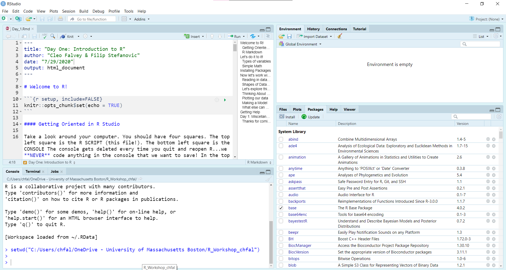

# Welcome to R!

```{r setup, include=FALSE}
knitr::opts_chunk$set(echo = TRUE)
```

#### Getting Oriented in R Studio

Take a look around your computer. You should have four squares. Going from top left and clockwise, we have:

- The top left square is the R SCRIPT (this file!).
- The bottom left square is the CONSOLE. The console gets deleted every time you quit and reopen R...we **NEVER** code anything in the console that we want to save!
- In the top right corner you can see the ENVIRONMENT. That's where all of our variables are going to live that we've made in this R session.
- In the bottom right square we have our FILE DIRECTORY, our PLOT display, and the list of PACKAGES we have installed in our R (click on the different tabs).

```{r, out.width="100%"}

```

### R Markdown

This is an R Markdown document. Markdown is a simple formatting syntax for authoring HTML, PDF, and MS Word documents. For more details on using R Markdown see <http://rmarkdown.rstudio.com>.

When you click the **Knit** button a document will be generated that includes both content as well as the output of any embedded R code chunks within the document. **However, if there are bugs or errors in the code, it will quit without rendering! This means you need to make sure there are no errors in your script every time before you finalize it!** You can embed an R code chunk like this:

```{r}
print("Hello world!")

# You can use hashtags to comment your code. R will ignore this line. If you weren't to have put a hashtag, then R might throw an error.
```

---

# Let's do it to it!

R is a very versatile language.

```{r}
x <- c(12,3,15,20,5)

```

Now, you try! In the code chunk below, create a vector of numbers named y using the _c()_ (concatenate) function. Notice the assignment function. In particular, notice how you use <- to assign the variable. Also look for the commas in between each individual digits, which tells R that you want to store five numbers and not just one giant number 12315205.

```{r}
# Now, you try! Type your code below. Make a vector named y that includes any five numbers you like. It could be 2,4,6,8.

```


### Simple Math

R is, at its base, a statistical language. Here are a few functions you might find yourself using.

```{r}
mean(x) # takes the mean of the vector x which we named above.
sd(x) # standard deviation
sum(x)
summary(x) # provides min, 1st quartile, median, mean, 3rd quartile, max

# Now, you try! Run summary() on your vector, y.

```


### Types of Variables

R has many types of variables, not just numbers. The nice thing about R is that it doesn't really distinguish between integers and doubles, like some other programming languages (cough-cough, Java.)

For example, there are also character variables.

```{r}
alphabet <- c("a","b","c","d","e")

# Now, you try! Create a vector called animals which holds the words: "cat", "dog", "lizard". Or create a vector that holds any words you like. Remember strings and characters go in quotes!

```

There are also logical variables (TRUE/FALSE). These are also sometimes called boolean variables.

```{r}
boolean <- c(TRUE, FALSE, NA, TRUE, FALSE)

#Now, you try! Create a boolean variable called boolean2 which has value TRUE TRUE FALSE FALSE. 

```

For all of these data types, R also supports NA as a value (missing value).

More info on basic R data types can be found [here](https://swcarpentry.github.io/r-novice-inflammation/13-supp-data-structures/).

---

# Installing Packages

To install packages, we're going to run the _install.packages()_ command. This command should be run in the CONSOLE. This is because if you don't do that, every time you run the script, it will install the packages from CRAN. This is a waste of time and energy and Internet and it'll make your script run slower.

That's why we only install once (and update as necessary). But when we start a script we need to call our libraries at the beginning. From now on, in my setup chunk of code, I'll call all the libraries we'll need to be using (usually just Tidyverse for now).

In this R workshop, we are going to be using Tidyverse a lot. The Tidyverse is a fairly comprehensive group of packages that work together in a really sweet way. The lead scientist is probably my favorite data scientist Hadley Wickham (I met him in person once!).

```{r}
# Below is the code to install the Tidyverse. ONLY RUN THIS ONCE! To run it, remove the # before the line, and then either delete the line or comment it back out again with #.
# install.packages(tidyverse)
```

To install libraries, you may need to run R as an administrator on your laptop to allow it to write to your disk space. It's also important that you are connected to the Internet because R pulls down packages from CRAN (Comprehensive R Archive Network).

If we've successfully installed the package, we call them to our R session with the library function.

```{r}
library(tidyverse)
```

---

# Now let's work with a dataset!

### Reading in Datasets

But what happens if you have a lot of data? Like, thousands of rows of data? You don't want to be putting everything in as a vector. That's where we use the _read()_ functions from the _readr_ package (part of the Tidyverse).

You can read in multiple types of files. The one I prefer is .csv (comma-separated values) file. This is basically just an Excel file but doesn't end in .xlsx. You can also use .tsv, .txt, and so forth.

To _get_ a .csv file from an Excel file, you just save as a .csv (in Excel). The .csv file we are going to work with today is modified from this Kaggle dataset I found about the chances of applying to graduate school: [Kaggle](https://www.kaggle.com/tanmoyie/us-graduate-schools-admission-parameters?select=US_graduate_schools_admission_parameters_dataset.csv) is a great resource for free datasets and also you can enter competitions. 

```{r}
library(readr) # this package comes loaded with Tidyverse, though, and we've already loaded that!
grad_school <- read_csv("grad_school.csv")
```

**It is very important that you put the .csv file and the R script you are working with in the SAME FOLDER!**

### Shapes of Datasets

Data frames, matrices, and tibbles encompass the bulk of the data sets we manipulate in R. I prefer to use the [Tidy concept](https://cran.r-project.org/web/packages/tidyr/vignettes/tidy-data.html) of using one row for one observation, and one column for one variable.

The grad_school.csv file above is a dataset in Tidy format already. This is because each column is a different variable (GRE scores, GPA, etc.) and each row is a different applicant (as denoted by applicant number).

### Let's explore this data set!

I always use the _str()_ command or the _head()_ command when I import data. The _str()_ function stands for "structure". The _head()_ command prints the top few values of the dataset to the console.

```{r}
str(grad_school)
head(grad_school)
```

### Thinking About Data

The most important thing about data is it always has to tell a story. When you're working with real-life data, whether it be from your independent research project, working in STEM, or even if you're sick of R by this point and only want to use Excel from now on, you still need to be able to tell a story with data.

You want to think about what questions you can answer and ask with data. Let's think about some questions we can ask with our grad school dataset.

### Plotting Our Data

We usually answer our questions about data with plots, tests, or models.

### Making a Model 

The _lm()_ function in R runs a linear regression and follows the formula: lm(dependent variable ~ independent variable, dataset). You may have done linear regressions before in Physics (certain types of momentum) or Chemistry (Beer's Law).

Let's use the _lm()_ function to correlate GRE scores based on GPA.

```{r}
gre_gpa <- lm(gre~gpa, grad_school) # this makes a model
summary(gre_gpa) # this makes a summary of your linear model
```

### ggplot2

This is our linear model we've made. I've plotted it in ggplot2, which will be covered in the second and third sections of our class. R has a base plot functionality that is useful for quick-and-dirty plots, but ggplot2 has a lot more functionality and I'm going to teach you it in this session. The reason is because it's the _harder_ of the two; _plot()_ and _hist()_ can be picked up easily on your own once you become more familiar with R programming!

For now, you don't need to understand _how_ the graph was made, although I did put comments next to every line explaining how it was done. We'll cover exactly how to use _ggplot2_ in the second and third sections. However, you should be able to look at at and interpret this graph.

```{r, out.width="100%"}
ggplot(grad_school, aes(x=gpa, y=gre)) + # call ggplot(dataset, aes(x,y))
  geom_point(color="darkgreen") + # we want to make a point graph
  geom_smooth(method="lm") + # add the line atop, using the linear model method
  labs(title="The Relationship Between GRE Scores and GPA") #title on top
```

Looking at the model and the plots, we can see that the general takeaway seems to be that if you have a higher GPA, you'll get a higher score on the GRE.

### What else can we explore in the data?

```{r}
# Now, you try! Using the grad_school dataset, make a linear model that correlates the qualitative score an applicant received on their purpose statement and their letters of recommendation.
# If you're feeling brave, try to plot it with ggplot2!

```

---

# Getting Help

Phew! That was a lot of work. It's totally okay if you're feeling overwhelmed by this point. The good thing is that there is so much documentation you can use. Here's the documentation for the _readr_ package we used to read our .csv file in about salaries.

```{r}
# the help page for the readr package
help(readr)
# the help page for the readr function read_csv(), which we just used above.
help(read_csv)
```

# Day 1: Miscellaneous Takeaways

- Use the <- operator to assign variables and datasets.
- Use library(package_name) to call packages you need.
- Run code in chunks with control + enter.
- R Markdown files will NOT knit if you have a bug. This means it's important for you to debug the entirety of your code before you "knit" it!
- R is very finicky. Don't be too upset if it doesn't work right.
- Think about ways we will tell stories with data! :)


### Thanks for coming, and stay tuned for the next session: Data Cleaning with _dplyr_ and plotting with _ggplot2_!