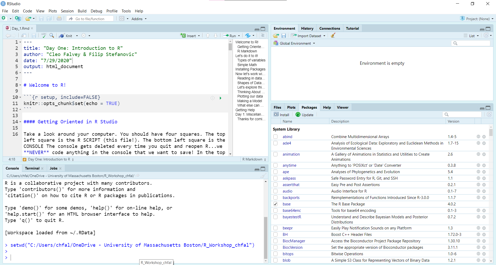

# Welcome to R!

In today's session we will explore what R is and what it can do. R is a powerful tool for data analysis and visualization. First, let's see an example of what you can do!

```{r}
# don't worry about the details of this code for now. By the end of this workshop you will learn what each of these components means and how to use them!

library(tidyverse)

grad_school <- read_csv("grad_school.csv")

ggplot(grad_school, aes(x = gpa, y = admission_percent)) +
  geom_point(aes(color = university_ranking)) + 
  geom_smooth(method = "lm", color = "orange") + 
  labs(
    title="GPA vs Acceptance for Grad School",
    color = "University Ranking",
    x = "GPA",
    y = "Admission Percent"
    )+
  theme_minimal()

```

Take a moment to think about what this graph shows you. The primary goal of data visualization is to help us make sense of the data we've collected. Over the course of this workshop, we will learn some of the basics that will allow you to start creating plots like this one. 


#### Getting Oriented in R Studio

```{r, out.width="100%"}

```

Take a look around your computer. You should have four squares. Going from top left and anticlockwise, we have:

- The top left square is the R SCRIPT (this file!).

- The bottom left square is the CONSOLE. The console gets cleared every time you quit and reopen R...we **NEVER** code anything in the console if it's important and we want to save it later!

- In the bottom right square we have our FILE DIRECTORY, our PLOT display, and the list of PACKAGES we have installed in our R (click on the different tabs).

- In the top right corner you can see the ENVIRONMENT. That's where all of our variables are going to live that we've made in this R session.

### R Markdown

This is an R Markdown file. 

When you open R for the first time, it will open an R script file. Take a look at what a script looks like by clicking control+shift+N (windows) or command+shift+N (apple). Take a moment to note the differences. 


Scripts are easier to work with when you first start using R but lack the structural versatility of an .Rmd file. R Markdowns make it easy for people to share their work and communicate what they are doing -- just like we are right now!

A really nifty feature of .Rmd files is that it allows you to print out HTML, PDF, or Word documents of your script and output. You can try it out by clicking the Knit button on the top of the R SCTIPT pane. 

**Note** Make sure your R Script doesn't have any errors, otherwise the function won't run! 


R Markdowns also allow you to embed an R code chunk like this:

```{r}

print("Hello world!")

# You can use hashtags to comment your code. R will ignore this line. If you weren't to have put a hashtag, then R might throw an error.
```

---


# Let's do it to it!

R is a very versatile language. It allows you to store information into variables like this:

```{r}

x <- c(12,3,15,20,5)

# Now, you try! Create a new variable y that stores any five numbers.


```


### Simple Math

R is, at its base, a statistical language. Here are a few functions you might find yourself using.

```{r}

mean(x) # takes the mean of the vector x which we named above.

sd(x) # standard deviation

sum(x) 

summary(x) # provides min, 1st quartile, median, mean, 3rd quartile, max

# Now, you try! Run summary() on your vector, y.


```


### Types of Variables

R has many types of variables, not just numbers. The nice thing about R is that it doesn't really distinguish between integers and doubles, like some other programming languages (cough-cough, Java.)

For example, there are also character variables.

```{r}
alphabet <- c("a","b","c","d","e")

# Now, you try! Create a vector that holds any words you like. Remember strings and characters go in quotes!


```

There are also logical variables (TRUE/FALSE). These are also sometimes called boolean variables.

```{r}
boolean <- c(TRUE, FALSE, NA, TRUE, FALSE)

# Now, you try! Create a boolean variable called boolean2 which has value TRUE TRUE FALSE FALSE, or any TRUE/FALSE variables you like. Remember that TRUE and FALSE should be capitalized, but without quotes. 

# Side note: R stores TRUE as 1 and FALSE as 0, so you can even do math with it (useful for proportions and binary).

```

For all of these data types, R also supports NA as a value (missing value).

More info on basic R data types can be found [here](https://swcarpentry.github.io/r-novice-inflammation/13-supp-data-structures/).

---


# Installing Packages

To install packages, we're going to run the _install.packages()_ function. This function should be run in the CONSOLE, otherwise every time you run your script you run the risk of installing the packages again. This is a waste of time and it'll make your script run slower.

That's why we only install once (and update as needed). However, in order to use these packages in our script, we must first call them from our libraries. This is done by using the _library()_ function. If you go back to the beginning of the script, this is what we did in order to graph the iris data!

In this R workshop, we are going to be using Tidyverse a lot. Tidyverse is a fairly comprehensive group of packages that work together in a really sweet way. The lead scientist of RStudio and Tidyverse is Hadley Wickham, a really cool statistician from New Zealand (Cleo met him in person once!).

**Note** To install libraries, you may need to run R as an administrator on your laptop to allow it to write to your disk space. It's also important that you are connected to the Internet because R pulls down packages from CRAN (Comprehensive R Archive Network).

```{r}

library(tidyverse)

# since we already loaded tidyverse at the top of the session, it will run more quickly than it will when you first open RStudio.
```

---


# Now let's work with a dataset!

### Reading in Datasets

But what happens if you have a lot of data? Like, thousands of rows of data? You don't want to be putting everything in as a vector. That's where we use the _read()_ functions from the _readr_ package (part of the Tidyverse).

You can read in multiple types of files. The one we prefer is .csv (comma-separated values) file. This is basically just an Excel file but doesn't end in .xlsx. You can also use .tsv, .txt, and so forth.

To _get_ a .csv file from an Excel file, you just save as a .csv (in Excel). The .csv file we are going to work with today is modified from this [Kaggle dataset](https://www.kaggle.com/mohansacharya/graduate-admissions) Cleo found about the chances of applying to graduate school:


```{r}

library(readr) # this package comes loaded with Tidyverse, though, and we've already loaded that!

grad_school <- read_csv("grad_school.csv")

```

**It is very important that you put the .csv file and the R script you are working with in the SAME FOLDER!** To check and make sure where this file should go, use the _getwd()_ function and move it, or the file, if necessary. 


### Shapes of Datasets

Data frames, matrices, and tibbles encompass the bulk of the data sets we manipulate in R. I prefer to use the [Tidy concept](https://cran.r-project.org/web/packages/tidyr/vignettes/tidy-data.html) of using one row for one observation, and one column for one variable.

The grad_school.csv file above is a dataset in Tidy format already. This is because each column is a different variable (GRE scores, GPA, etc.) and each row is a different applicant (as denoted by applicant number).

### Let's explore this data set!

I always use the _str()_ command and the _head()_ command when I import data. The _str()_ function stands for "structure". The _head()_ command prints the top few values of the dataset to the console.The _tail()_ function prints out the bottom few values of the dataset. 

```{r}

str(grad_school)

head(grad_school)

tail(grad_school)

```

### Thinking About Data

When working with a dataset, the goal is to uncover the story that the data is telling. Sometimes, this story is obvious but more often than not it is buried deep within the rows and rows of observations. Even when it seems like you have tried everything or you are beginning to suspect R hates _you_ specifically, the key thing is to keep chipping away at it. The story is there, you just have to learn how to translate it to something everyone can understand.

You want to think about what questions you can answer and ask with data. Let's think about some questions we can ask with our grad school dataset.

### Plotting Our Data

We usually answer our questions about data with plots, tests, or models.

### ggplot2

This is our linear model. We've now plotted it in ggplot2, which will be covered in the second and third sections of our class. R has a base plot functionality that is useful for quick-and-dirty plots, but ggplot2 has a lot more functionality. 

For now, you don't need to understand _how_ the graph was made (however, there are comments next to every line explaining how it was done). We'll cover exactly how to use _ggplot2_ in the second and third sections. But first, let's look at the graph and see what inferences we can make about GPA and GRE scores.

```{r, out.width="100%"}

ggplot(grad_school, aes(x=gpa, y=gre)) + # call ggplot(dataset, aes(x,y))
  geom_point(aes(color = university_ranking)) + # we want to make a point graph that distingushes the scools ranking 
  geom_smooth(method="lm") + # add the line atop, using the linear model method
  labs(
    title="Relationship Between GRE Scores and GPA",
    color = "University Ranking"
    ) # title on top, rename the legend

```


### Making a Model 

The _lm()_ function in R runs a linear regression and follows the formula: lm(dependent variable ~ independent variable, dataset). You may have done linear regressions before in Physics (certain types of momentum) or Chemistry (Beer's Law).

Let's use the _lm()_ function to correlate GRE scores based on GPA.

```{r}
gre_gpa <- lm(formula=gre~gpa, data = grad_school) # this makes a model


summary(gre_gpa) # this makes a summary of your linear model
```

### What else can we explore in the data?

```{r}
# Now, you try! Using the grad_school dataset, make a linear model that correlates the qualitative score an applicant received on their purpose statement and their letters of recommendation.
# If you're feeling brave, try to plot it with ggplot2!

```

---

# Getting Help

Phew! That was a lot of work. It's totally okay if you're feeling overwhelmed by this point. The good thing is that there is so much documentation you can use. Here's the documentation for the _readr_ package we used to read our .csv file in about salaries.

```{r}

# the help page for the readr package
help(readr)

# the help page for the readr function read_csv(), which we just used above.
help(read_csv)

```

It is important to note that reading the help pages of most of the packages and functions is extremely difficult and takes a long time to learn how to understand. While it is a good place to start your search if you have a question, remember that your best friend for fixing error messages is none other than the old reliable (google). 


# Day 1: Miscellaneous Takeaways

- Use the <- operator to assign variables and datasets.
- Use library(package_name) to call packages you need.
- Run code in chunks with control + enter (windows), command + return (apple)
- R Markdown files will NOT knit if you have a bug. This means it's important for you to debug the entirety of your code before you "knit" it!
- R is very finicky. Don't be too upset if it doesn't work right.
- Think about ways we will tell stories with data! :)


### Thanks for coming, and stay tuned for the next session: Data Cleaning with _dplyr_ and plotting with _ggplot2_!


Additional resources:

Kaggle is a great resource for free datasets and you can also enter competitions. 


