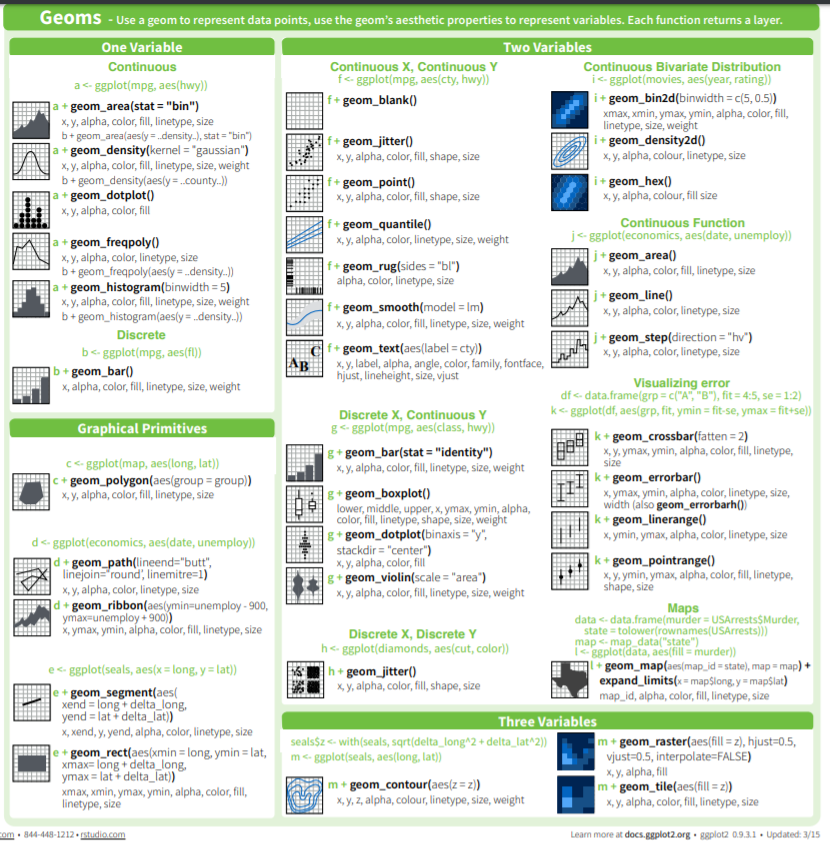

# Welcome back!

It's been a week since we last met. And I am so thrilled to see y'all again because today we are diving into the Tidyverse!

### Remember, before we do anything, we need to call our libraries!

We shouldn't have to install anything new! If R asks you to install the package again, something has gone wrong!

```{r}
library(tidyverse)
```

# Tidyverse

What's the Tidyverse? It's a really easy and clean workflow in R. We did a little bit of it last time when we read the .csv files in, but today, we are going to do a little bit more!

```{r}
knitr::include_graphics("tidyverse-package-workflow.png")
```

# readr

### Reading Data

We read data in with _read_csv()_. There's a version with a period ( _read.csv_ ) but it sometimes does finicky things when reading in data. That's why we always use the Tidy option!

Today's dataset is about Spotify songs from 2010-2019. It lives on Kaggle [here](https://www.kaggle.com/leonardopena/top-spotify-songs-from-20102019-by-year?select=top10s.csv). It's also in your working directory as a file called spotify.csv.

Don't forget! R should have imported the data frame as a **Tibble** (a very cute word) that just refers to a tidy data frame.

```{r}
spotify <- read_csv("spotify.csv")
```

We always want to know what our data is like. _head()_ and _str()_ help us make sure our data are the right type and that everything was read in correctly. _class()_ helps make sure that the object is a tibble or data frame.

```{r}
head(spotify)
class(spotify) # this command tells us what type of data frame this object is. If all's well, it should be a tibble!
```

Some of the metrics may only make sense to the most well-attuned music lover. Which is not me, so I read the documentation attached to the dataset.

- bPM: how fast the song is
- dB: how loud the song is
- Duration: How long the song is
- Popularity: How popular the song is


# ggplot2 

### Visualizing Data

ggplot2 is the most popular package for data visualization. However, it's tricky to get the hang of. Here's a Shiny app (R-based web application) that shows you how to use [ggplot2](https://shiny.gmw.rug.nl/ggplotgui/).

the ggplot function is structured  like this:
```ggplot(data, aes(x=x_variable, y=y_variable, fill=z_variable)) + geom_layer()```

That's a lot to break down. Basically, the data is the data frame, the aesthetic is anything you can see (x and y variables), and the z variable is a third variable (for example if you wanted to add a color, shape, or fill. It's also optional, but can be helpful to distinguish different sets of data.) The _geom_layer()_ part will change and depends on what kind of data you have.

**I tend to think about the aesthetic as the setup and the _geom_ object as the layer on top that you can see.**

A very basic ggplot2 graph is below.

```{r}
ggplot(spotify, aes(x=duration,y=popularity, color=as.factor(year))) + #data is spotify, aesthetic x is energy, aesthetic y is popularity
  geom_point() + #geom_point is the type of graph we want to make
  labs(x="Energy of Song", y="Popularity of Song", title="Energy vs. Popularity in 600 Top Spotify Songs", subtitle="Graph by Cleo Falvey") # the labs function allows you to rename x and y axes, as well as create a title and subtitle. Note the use of quotation marks for strings.
```

```{r}
# Now, you try! Let's create a scatterplot of each song's acoustic versus speaking scores.

```

### Now let's add a little spice.

Recall this:

```{r, out.width="100%"}

```

This will help when deciding what to style to make your graph. I prefer _geom_boxplot()_, _geom_smooth()_, _geom_point()_, and _geom_line()_. The reason for this being that there are many types of graphs here but people are the most familiar with those types of graphs. That's helpful because you want your viewers to spend time looking at the story the graph is telling and not being confused because they've never seen a violin plot before, for example.

This graph answers the question of how popularity changes as year changes, with year as a factor.

```{r}
spotify %>% # this is a pipe, we'll learn about it in a second
  mutate(year=as.factor(year)) %>% # this is taking year, which is currently a double, and changing it into a factor. this is a mutate, we'll learn about that in a second as well.
  ggplot(aes(x=popularity, y=year,group=year, fill=year)) + #we need to always have a grouping variable when we make boxplots, this is the setup
  geom_boxplot() # this is the boxplot layer
```

```{r}
# let's make another graph together here! :)
```

# dplyr

dplyr and tidyr are amazing packages, but can be hard especially when you're starting out. And don't worry, while I was making this presentation, I StackOverflowed at least six things.

In order to use dplyr, we need to think about data frames as objects; they can be changed (mutated), filtered, and summarized.

### Piping Data

# %>%

The above symbol is what's known as a pipe in dplyr. The pipe signifies that you are taking the data frame (our example data frame is _spotify_) and putting the whole data frame through a series of functions to get a whole new data frame.

```{r}
# makes new data frame of the top six rows of the spotify dataset. 
short_spotify <- spotify %>% # take spotify data frame and pipe
  head() # pipe it through the head function to get only the top six rows.

short_spotify
```

```{r}
# Now, you try! Make a dataset called short_spotify2, which is the same thing as above except uses the tail() function. The tail() function shows the last six rows of the dataset.
```

### Filtering & Selecting Data

Let's take a look at our Spotify data. A lot of popular songs are by Bruno Mars. How many are there, and what are they? To figure this out, we're going to use _filter()_, which looks for matching rows in the dataset.

```{r}
bruno_mars <- spotify %>%
  filter(artist=="Bruno Mars") #artist name must be equal to Bruno Mars. We use the double equals sign in CS 
head(bruno_mars)
```
We took our spotify data and piped it to the _filter()_ function in dplyr. We wanted only the songs that were by Bruno Mars. We need to use the double equals sign (==), because if you only use one equals sign (=), R throws an error. You can try it!

You can also use different computer logic symbols with _filter()_.

- == means EQUALS TO
- != means NOT EQUALS TO
- && means AND
- || means OR

```{r}
# Now, you try! Pipe the Spotify dataset to a make a tibble of only songs by Katy Perry called katy_perry

# Extra challenge. Pipe the Spotify dataset to a tibble by songs only by Enrique Iglesias OR Lady Gaga.

```

There are fifteen Spotify variables. What if we only wanted to see only the titles and the authors?

To answer that question, we'll use select, which selects different columns of your data. Note the use of the _c()_ function; we need to concatenate and choose both title AND artist.

```{r}
title_artist <- spotify %>%
  select(c("title","artist"))
head(title_artist)
```

```{r}
# Now, you try! select only the genre column.

```

### Transforming Data

Sometimes, we need to transform data. For example, the Spotify data has a column called duration, but it's in seconds. What if we wanted to have a column for minutes and seconds (with seconds as a remainder?)

The mutate function does all that and a bag of chips! The mutate function is incredibly useful. Mutate makes a brand-new column of your data that has some transformation applied to it from an existing column. Therefore, each observation has the same mutate function applied to it! Let's see how it works.

```{r}
spotify_durations <- spotify %>%
  select(title, duration) %>% # i only wanted a few of the data columns - title and duration
  mutate(minutes = duration %/% 60) %>% # %/% gives the dividend without remainder
  mutate(seconds = duration %% 60) # %% gives the modulo, or remainder
head(spotify_durations)
```

```{r}
# Now, you try. Use spotify_durations and mutate the song duration into  hours from seconds (yeah, no one would ever think of most songs in terms of hours, but that's not the point.)

```


### Summarizing Data

Sometimes, you don't want thousands of rows of data. Sometimes you only want a summary. That's when we use two best-friend functions in R, _group_by()_ and _summarize()_.

The below data frame answers the question: What was the average popularity score of a song for each year?

```{r}
spotify_years <- spotify %>% # takes spotify
  group_by(year) %>% #groups by each year 2010-2019
  summarize(mean_popularity = mean(popularity)) # summarizes mean of popularity
head(spotify_years)
```


```{r}
# Now, you try! Create a dataframe called genre_durations which is grouped by genre and gives you the mean of the duration of the song.
```

You can also use summarize_if() to apply a conditional statement. The below dataframe answers the question: What are the average scores for each numeric category in the dataset by genre?

Note the fact that because _year_ is numeric, R took the mean of the year. That doesn't really make sense given the context of the data. So if I wanted to graph something with year, I would need to change my code so it grouped by year as well. Always think about your data in context!

```{r}
spotify_genres  <- spotify %>%
  group_by(genre) %>%
  summarize_if(is.numeric, mean)
head(spotify_genres)
```

### Chaining multiple commands together

Which artist has the most number of popular songs on Spotify? Could it be ...unfortunately... _Justin Bieber_ ???

To answer this question, I took the Spotify data and sent it through a series of dplyr commands. I took the Spotify data and grouped it by the artist and counted the instances of each artist. Then, I arranged it in descending order.

The upshot of all of this is that you can pipe with ruthless efficiency and chain a bunch of different commands together rather than doing it one step at a time and creating a bunch of different datasets that we save to the environment.

```{r}
popular_artists <- spotify %>% # take spotify dataframe
  group_by(artist) %>% # group by artist
  count() %>% # count each instance of artist
  arrange(desc(n)) # arrange in descending order by n
head(popular_artists)
```


### What if my data is not in the right format?

That happens sometimes! For that, we use _pivot_longer()_ and _pivot_wider()_. I cover how to use those functions in the bonus material!

# Miscellaneous Takeaways: Day 2

- When I make an R script, I try to organize my chunks of code. The first chunk is always the libraries you need to use in the script. The second chunk is always reading in the data. The third (and sometimes fourth, fifth, sixth) is data manipulation. After that I put all the code you need to make the models and the graphs.
- Remember to be careful with parentheses in ggplot2, and always map data using _aes()_.
- _dplyr_ can take a little getting used to. Again, I still find myself Googling lots of "simple" things. Reading the documentation can also help. There is a joke in the software development world regarding whether you should take 30 seconds to read the documentation or literally hours to debug. It's your choice (I never choose correctly.)


### Stay tuned for our third day of content, where we'll be putting it all together - readr, dplyr, and ggplot2. We'll also be working in small groups :)