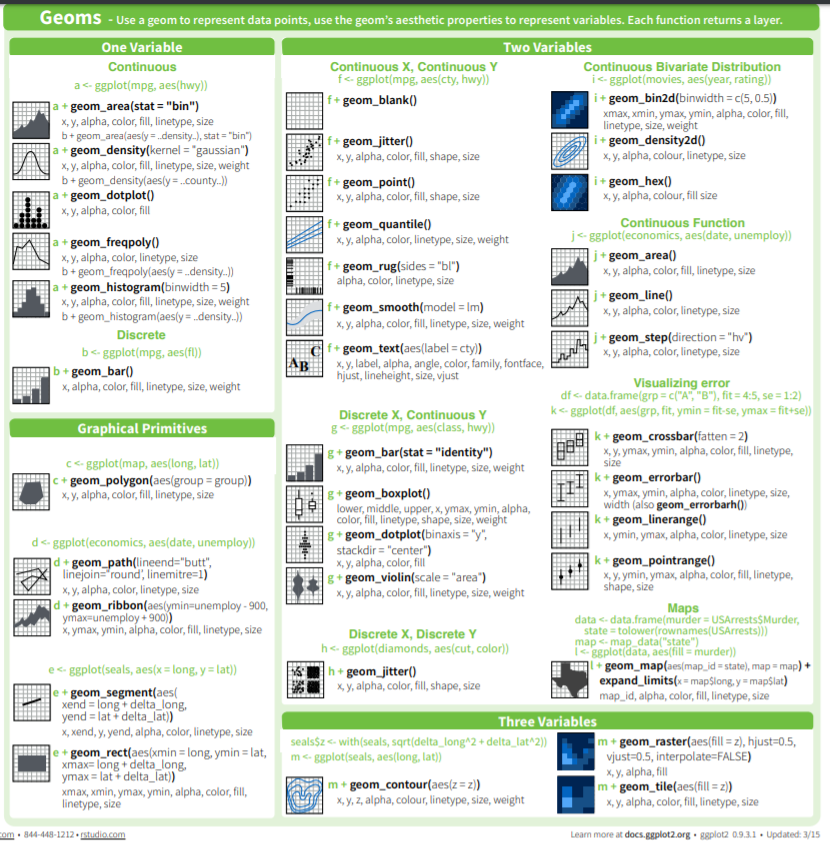

# Welcome back!

It's been a while since we last met. We am so thrilled to see y'all again because today we are diving into plotting and tidying!


### Remember, before we do anything, we need to call our libraries!

We shouldn't have to install anything new! If R asks you to install the package again, something has gone wrong, so let one of the session leaders know!

```{r}
library(tidyverse)
```


# Tidyverse

What's the Tidyverse? It's a really easy and clean workflow in R. We did a little bit of it last time when we read the .csv files, but now we're adding onto it!

```{r}
knitr::include_graphics("tidyverse-package-workflow.png")
```


# readr

### Reading Data

We read data in with _read_csv()_. There's a version with a period ( _read.csv_ ) but it sometimes does finicky things when reading in data. That's why we should always use the one with the underscore that comes from the _readr_ package!

Today's dataset is about Spotify songs from 2010-2019. It lives on Kaggle [here](https://www.kaggle.com/leonardopena/top-spotify-songs-from-20102019-by-year?select=top10s.csv). It's also in your working directory as a file called spotify.csv.

Don't forget! R should have imported the data frame as a **Tibble** (a very cute word) that just refers to a tidy data frame. (One row per observation, one variable per column.)

```{r}

spotify <- read_csv("spotify.csv")

```


We always want to know what our data is like. _head()_ and _str()_ help us make sure our data are the right type and that everything was read in correctly. _class()_ helps make sure that the object is a tibble or data frame.

```{r}

head(spotify)

class(spotify) 
# this command tells us what type of data frame this object is. If all's well, it should be a tibble!

```

Some of the metrics may only make sense to the most well-attuned music lover. in case you are unfamiliar, here is a brief summary

- bPM: How fast the song is
- dB: How loud the song is
- Duration: How long the song is
- Popularity: How popular the song is (based on Spotify metrics found [here](http://organizeyourmusic.playlistmachinery.com/))


# ggplot2 

### Visualizing Data

ggplot2 is a popular package for data visualization. However, it's tricky to get the hang of. Here's a Shiny app (R-based web application) that shows you how to use [ggplot2](https://shiny.gmw.rug.nl/ggplotgui/).

the ggplot function is structured  like this:

```ggplot(data, aes(x = x_variable, y = y_variable, fill = z_variable)) + geom_layer()```

That's a lot to break down. Basically, the data is the data frame, the aesthetic is anything you can see (x and y variables), and the z variable is a third variable (for example if you wanted to add a color, shape, or fill. It's also optional, but can be helpful to distinguish different sets of data.) The _geom_layer()_ part will change and depends on what kind of data you have.

**It can be helpful to think about the aesthetic as the setup and the _geom_ as the layer on top that you can see.**

A very basic ggplot2 graph is below.

```{r}

ggplot(data = spotify, aes(x = duration, y = popularity, color = as.factor(year))) + #data is spotify, aesthetic x is energy, aesthetic y is popularity
  geom_point() + #geom_point is the type of graph we want to make
  labs(
    x = "Duration of the Song",
    y = "Popularity of Song", 
    title = "Duration vs. Popularity in 600 Top Spotify Songs", 
    subtitle = "Graph by Cleo & Filip"
    ) # the labs function allows you to rename x and y axes, as well as create a title and subtitle. Note the use of quotation marks for strings.

```

```{r}
# Now, you try! Let's make another graph!
ggplot(data = spotify, mapping = aes(x=bpm, y=popularity, color = as.factor(year))) +
  geom_jitter() +
  labs(x = "Beats per Minute", y = "Popularity", title = "Beats per Minute by Popularity of 100 Top Spotify Songs", color = "Year")

```


### Now let's add a little spice.

This will help when deciding what to style to make your graph. We prefer _geom_boxplot()_, _geom_smooth()_, _geom_point()_, _geom_jitter_, and _geom_line()_. These will be familiar to most people who might find themselves looking at your graph and are therefore the most powerful tools for telling a story. That's helpful because you want your audience to spend time looking at what the graph is saying and not by being confused because they've never seen a violin plot before.


This graph answers the question of how popularity changes as year changes, with year as a factor.

```{r}

spotify %>% # this is a pipe, we'll learn about it in a second
  mutate(year = as.factor(year)) %>% # this is taking year, which is currently a double, and changing it into a factor. this is a mutate, we'll learn about that in a second as well.
  ggplot(aes(x = popularity, y = year, group = year, fill = year)) + #we need to always have a grouping variable when we make boxplots, this is the setup
  geom_boxplot() # this is the boxplot layer

```

---

# But what happens if you have "ugly" data?

# dplyr

dplyr and tidyr are amazing packages, albeit tricky at first. Don't worry, while making this presentation, StackOverflowed was visited at least six things!

In order to use dplyr, we need to think about data frames as objects; they can be changed (mutated), filtered, and summarized.

### Piping Data

# %>%

The above symbol is what's known as a pipe in dplyr. The pipe signifies that you are taking the data frame (our example data frame is _spotify_) and putting the whole data frame through a series of functions to get a whole new data frame. See the example below.

For example, we can use dplyr to create a new data frame which answers the question, "What artist has the most number of songs in the Billboard Hot 100 from 2010-2019?" We can see that the answer is Katy Perry, with 17 songs, and Justin Bieber at a close second with 16 songs.


Helpful tip: typing _%>%_ out every time is tedious and requires some odd finger-stretching. Instead, try using the shortcut which is control + shift + M for windows and shift + command + M for apple. 

```{r}

number_of_songs <- spotify %>% # take spotify dataframe
  group_by(artist) %>% # group by artist
  count() %>% # count each instance of artist
  arrange(desc(n)) %>% # arrange in descending order by n
  rename(number_of_songs = n)

head(number_of_songs)

ggplot(data = number_of_songs, mapping = aes(x=number_of_songs)) +
  geom_bar(fill="turquoise") +
  labs(x="Number of Songs Per Artist on the Billboard Hot 100", y="How Many Artists Had That Number of Songs", title="Distribution of Number of Songs on the Billboard 100 per Artist") +
  theme_bw()
  
# We can see that this graph shows most artists only have one or two songs on the Billboard Hot 100, but a few like Katy Perry and Justin Bieber have so many.

```

### Transforming Data

Sometimes, we need to transform data. For example, the Spotify data has a column called duration, but it's in seconds. What if we wanted to have a column for minutes and seconds (with seconds as a remainder?)

The mutate function does all that and a bag of chips! The mutate function is incredibly useful. Mutate makes a brand-new column of your data that has some transformation applied to it from an existing column. Therefore, each observation has the same mutate function applied to it! Let's see how it works.

```{r}
spotify_durations <- spotify %>%
  select(title, duration) %>% # i only wanted a few of the data columns - title and duration
  mutate(minutes = duration %/% 60) %>% # %/% gives the dividend without remainder
  mutate(seconds = sprintf("%02d", duration %% 60)) %>% # gives the remainder with leading zero as needed
  mutate(total_time = paste0(minutes,":", seconds)) # paste minutes and seconds to get total time

head(spotify_durations)

```

### Filtering & Selecting Data

Let's take a look at our Spotify data. A lot of popular songs are by Bruno Mars. How many are there, and what are they? To figure this out, we're going to use _filter()_, which looks for matching rows in the dataset.

```{r}

bruno_mars <- spotify %>%
  filter(artist == "Bruno Mars") #artist name must be equal to Bruno Mars. We use the double equals sign in CS 

head(bruno_mars)

```

We took our spotify data and piped it to the _filter()_ function in dplyr. We wanted only the songs that were by Bruno Mars. We need to use the double equals sign (==), because if you only use one equals sign (=), R throws an error. You can try it!

You can also use different computer logic symbols with _filter()_.


### A brief aside: Common symbols in computer logic.

- == means EQUALS TO
- != means NOT EQUALS TO
- && means AND
- | means OR

```{r}
# Now, you try! Pipe the Spotify dataset to a make a tibble of only songs by Katy Perry called katy_perry

# bonus challenge! Pipe the Spotify data set to make a tibble of songs by Katy Perry OR Lady Gaga.

```

There are fifteen Spotify variables. What if we only wanted to see the titles and the authors?

To answer that question, we'll use select, which selects different columns of your data.

```{r}

title_artist <- spotify %>%
  select(title, artist)

head(title_artist)

```

```{r}
# Now, you try! Select only the genre column to a dataset called genres.

```

### Summarizing Data

Sometimes, you don't want thousands of rows of data. Sometimes you only want a summary. That's when we use two best-friend functions in R, _group_by()_ and _summarize()_.

The below data frame answers the question: What was the average popularity score of a song for each year?

```{r}

spotify_popularity <- spotify %>% # takes spotify
  group_by(year) %>% #groups by each year 2010-2019
  summarize(mean_popularity = mean(popularity)) # summarizes mean of popularity

head(spotify_popularity)

# we can then graph it as necessary!

ggplot(data = spotify_popularity, mapping = aes( x = as.factor(year), y = mean_popularity)) +
  geom_point() +
  labs(x = "Year", y = "Mean popularity of song", title = "Mean Popularity of Song by Year")
```

You can also use summarize_if() to apply a conditional statement. The below dataframe answers the question: What are the average scores for each numeric category in the dataset by genre?

Note the fact that because _year_ is numeric, R took the mean of the year. That doesn't really make sense given the context of the data. So if we wanted to graph something with year, we would need to change our code so it grouped by year as well. Always think about your data in context!

```{r}

spotify_genres  <- spotify %>% # take spotify data
  group_by(genre) %>% # groups by genre of music
  summarize_if(is.numeric, mean) #summarizes all numeric variables by mean

head(spotify_genres)

```

### What if my data is not in the right format?

That happens sometimes! For that, we use _pivot_longer()_ and _pivot_wider()_. These functions are covered in the bonus material!


# Miscellaneous Takeaways: Day 2

- When we make an R script, we try to organize our chunks of code. The first chunk is always the libraries you need to use in the script. The second chunk is always reading in the data. The third (and sometimes fourth, fifth, sixth) is data manipulation. After that I put all the code you need to make the models and the graphs.

- Remember to be careful with parentheses in ggplot2, and always map data using _aes()_.

- _dplyr_ can take a little getting used to. Remember that Googling, StackOverflowing, and getting frustrated are just a part of the process. Reading the documentation help too There is a joke in the software development world regarding whether you should take 30 seconds to read the documentation or literally hours to debug.

- Below, we have a screenshot from the ggplot2 cheat sheet which can also be found in the R resources folder. It's a great way to think about data!

```{r, out.width="100%"}

```

### Stay tuned for our third day of content, where we'll be putting it all together - readr, dplyr, and ggplot2. We'll also be working in small groups :)