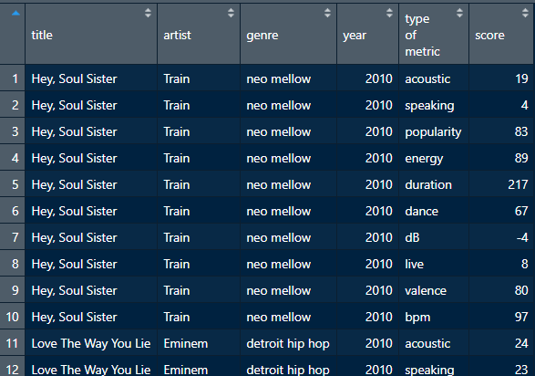

## A few extra fun things that I thought might take up too much time but are still useful to learn to do.

# Day One

### Making a Shapiro Wilk Test for GRE scores in grad school applications

```{r}
library(tidyverse) # call library you need - tidyverse includes readr

grad_school <- read_csv("grad_school.csv") # read in necessary file about graduate school
```

To plot a histogram of, for example, the GRE scores of the applicants, you could run the command below. We use the **$** operator to reference the columns of the dataset by name. This uses the base plotting function. While not ggplot, it is sometimes easier for quick-and-dirty plotting, and the _curve()_ function works really welll with Base R plotting (i.e. not ggplot2), so the following graph is really useful.

```{r}
hist(grad_school$gre) # makes a histogram of GRE scores
```

Looking at the dataset, we can see that the GRE scores do seem to show a normal distribution. In fact, the GRE is designed to have a normal distribution (some people do quite poorly, some people do quite well, and most people do right about the middle). How would we test whether this data set is normal?
  
  Answer: Use a Shapiro-Wilk test!
  
```{r}
shapiro.test(grad_school$gre)
```

Here's the results of the Shapiro-Wilk test. If you've taken a statistics class, you might remember that the threshold for significance is .05. This data seems to fail the Shapiro-Wilk test. It certainly does deviate from the normal distribution!
  
  Remember when we plot normal distributions that it has two parameters, mean and standard deviation.

```{r}
mean(grad_school$gre) # get mean of grad school gre scores
sd(grad_school$gre) # get standard deviation of grad school gre scores
hist(grad_school$gre, freq=F, xlim=c(280,360)) # relative frequency histogram with custom x axis limits
curve(dnorm(x, mean=316.8075, sd=11.47365), add=TRUE, col="darkblue", lwd=2) # curves a normal distribution atop a frequency histogram, used better with base plotting than with ggplot2
```


# Day Two:

### Built-in Datasets

R has built-in datasets that many people use, especially when trying to provide a reproducible example (reprex) when asking for help or debugging. These datasets can be found using the _data()_ function.

## Pivot Longer

Pivoting in dplyr can be very helpful if you want your data to be a different shape. Let's say, for example, that we wanted the Spotify data to look different. Here's what it looks like now:

```{r}
spotify <- read_csv("spotify.csv") #reads in spotify data
short_spotify <- head(spotify) # makes a shorter version of spotify
```

What if we wanted to have the data be longer than it is? i.e., we had just ONE column of numbers, and another column showed which value it was?

```{r, out.width="100%"}

```

Enter _pivot_longer()_ from dplyr. We use the pipe! In pivot longer, the first argument is the names of all the columns that we want to be pivoting. The next thing is it creates key-value pairs, which you need to rename (or else it'll just call them "key" and "value").

```{r}
long_spotify <- short_spotify %>%
  pivot_longer(cols=c("popularity","duration","dB","bpm"),names_to="type_of_metric", values_to="score")

head(long_spotify)
```

## Pivot Wider

In _pivot_wider()_, the same concept is utilized except. Below, I remake (and thus undo my long pivot) to create the same data frame with my long spotify data.

```{r}
short_spotify_again <- long_spotify %>%
  pivot_wider(names_from = "type_of_metric", values_from = "score")

head(short_spotify_again)
```

Pivoting is really useful because it changes the shape of data - sometimes certain functions need data to be structured a certain way.

# Day 3: Iris Analyses

Here is a sample workflow for the Iris dataset we'll be working with on Day 3.

### Reading in Data

```{r}
iris <- read_csv("Iris.csv")
```

### Petal Length, Petal Width

```{r}
ggplot(iris, aes(x=petal_length, y=petal_width, color=species)) +
  geom_point() +
  labs(x="Petal Length", y="Petal Width", title="Petal Length vs. Petal Width, Sorted by Species")
```


A boxplot of sepal length by species is below.

```{r}
ggplot(iris, aes(x=sepal_length, group=species, y=species, fill=species)) +
  geom_boxplot() +
  labs(x="Sepal Length", y="Species", title="Sepal Length by Species")
```

We can see from the boxplot and scatterplot that virginica is consistently the largest flower. One of the things that we might consider is examining the ratio of flower sizes. Sometimes that changes things!

To do this we are going to use dplyr & ggplot2.

```{r}
iris %>%
  mutate(petal_ratio = petal_length / petal_width) %>%
  ggplot(aes(x=petal_ratio, y=species, group=species, fill=species)) +
  geom_boxplot() +
  labs(x="Petal Ratio", y="Species", title="Petal Ratio by Species of Iris")
```

We can see that virginica is clearly the largest flower but has a different (smaller) petal length to petal width ratio than the other flowers.

These are just a few ideas I wanted to come prepared with to the R workshop. Feel free to come up with your own!