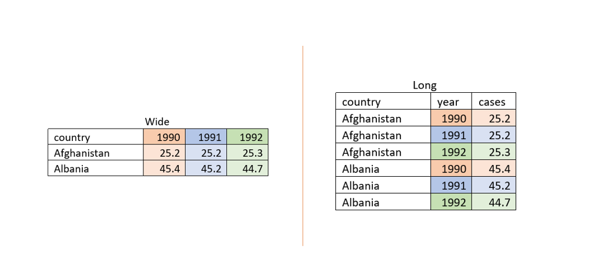

```{r setup, include=FALSE}
knitr::opts_chunk$set(echo = TRUE)
```

# intro

So far we've learned aout how to make use of different packages for manipulating data. But what actually goes on under the hood? What would you do if you had to a set of operations in a particular order over a whole set of values? ***Enter for loops!***

Let's break down the name:

* _for_ each variable in a given vector you 
* _loop_ over a set of operations.

To make it even more explicit, let's dive right in. 


# let's get loopy

Alright, now that we are set up, let's create a variable named *integers* that spans any range of numbers

```{r}
#create your variable here

integers <- 1500:1550

```

Say that these numbers represent a gross income of a variety of people and you wanted to calculate their net income. Assuming that taxes are 12%, we could write a loop such that

```{r}
for (i in integers){ # this sets the range of values (integers) we want to loop over
  net <- i*(100-12)/100 # here, we let R know what we want it to do with each value
  
  print(net) #and this is what lets us see the end result for each iteration! 
  
}
```

## for loop practice

```{r}
# now it's your turn! 
# create a variable with any name over a given range of numbers (or, if you're feeling frisky you can list out your own numbers {if so, don't forget to use the function c()!})


# now run a for loop that will figure out how much someone loses in taxes if those are their wages for the day!

```


That was easy! 

You have just witnessed the power and speed of a for loop! Now, let's dive a little more into the structure of a loop.

```
for (variable in vector) {

}
```

Our function is _for()_ and within it we have a few arguments. The first is a variable followed by _in_ and finished off by the vector we want to loop over. The variable can be anything you wanted to be and takes place of the values you want to perform the operations on. But be careful! Make sure the name of the variable doesn't already exist anywhere else in the script. This is a common error and can be avoided by assigning simple characters that you would otherwise not choose. 

However, this is only the setup for the loop. After we close the function, we see a new symbol we have not yet encountered: the curly wavy brackets things that I love using in texts to confuse people. Within these brackets ({}) we instruct our for loop what we would like done to each of the values. 

Finally, we have to print or store our values in order to see it. This, too, can be a point where you can get confused. If you do not explicitly instruct the software to show you what it has done or to remember it, the subsequent iteration of the loop will override the one you might be interested in. 


Enough chit chat, let's see some practical examples. 


# for loops in action

As always we first have to load our packages and import the data. 

## load packages

```{r}
library(tidyverse)
```


## import data

The dataset we will be using today tracks the number of new cases of lung cancer in men over time per 100,000 people in each country. The data is collected by gapminder and can be retrieved [here](https://www.gapminder.org/data/)

```{r}
lung_men_new <- read_csv("lung_cancer_new_cases_per_100000_men.csv")
```

Before we continue, let's pause for a moment? What is a good thing to do at this point? 

```{r}
#do what you must! 

```

Is this data tidy? Surprisingly, yes! Every column is a different variable, each row a different observation, and the cells only have one value each. But can we use ggplot on the dataset without augmenting it first?

Turns out that these data are what is known as *wide*, while the data that we're used to using in our graphing is known as *long*. Below, we see a brief illustration about the difference

```{r}

```


Basically, what we'll need to do is make each of the variables of the dataset (aka the column names) observation in a column of its own. If you look at the graph, this basically translates to 1990, 1991, and 1992 from table Wide being moved to a new column (year) in table Long with the corresponding data next to it. This is the process of going from wide to long data and what we will be doing using our for loop. 


Now we have our packages ready, our data is imported, and we have a good idea about what needs to get done. So let's get crackin'!


## data lengthening using a for loop

```{r}
# first, let's determine which years we are interested in exploring

years <- 1990:2016

# then, we should form an empty variable that will be our new dataset

lung_long <- data.frame()

# let's get cracking! 

for (t in years) { # set up the range of values to loop over
  
  t1 <- as.character(t) # create a temporary variable where our years will be made into character instead of numeric values
  
  temp1 <- lung_men_new %>% #create a new temporary variable with the dataset in it
    select(country, t1) %>% #we are selecting for all countries and the year the for loop is working on 
    mutate(year = t1) %>% #we're adding a new column with each cell containing the year
    rename(cases = t1) #and finally we're changing the name of the column with the number of cases to "cases"
  
  lung_long <- rbind(lung_long, temp1) #we then bind each of these mini datasets together to form the new, long dataset 
  
  rm(t1) 
  rm(temp1) #and we remove the temporary values using the function rm() to prevent any errors and cut down on things clogging up our environments

}


```

Let's break down this loop. What we are doing is asking the loop to take the data for all of the countries for each year that we specified using dplyr, we add a new row with the year we are in, and we give the columns new names. Once each of these mini sets for individual years is created, we stitch them together using a new function ***rbind()***. This function stacks the rows one on top of another. Alternatively, we could have used another function called ***cbind()*** which would have attached all the mini datasets horizontally. However, the cbind() operation would have made us have a new country column every time we manipulated a new year.

One note here is that the ***for()*** function is a part of base R and you do not need tidyverse to use it. I am using dplyr because it can simplify some operations and because you have just learned about some of its basics. But really, what dplyr is doing is just a series of highly specific and pre-made for loops! 

So we have a new dataset, now what? 

Well, whatever you want really. We can quickly make a plot of any country we're interested in for the full time span we have covered.

## ggplot (again)

We did all this hard work to change our data, now let's use it to make a pretty graph! Let's use all of the tools we've learned so far to plot the number of new cases in:

* China
* Sudan
* United States

```{r}
lung_long %>% 
  filter(country %in% c("China", "Sudan", "United States")) %>% 
  ggplot(aes(x = year, y = cases, color = country))+
  geom_point()+
  labs(
    title = "Number of New Cases of Lung Cancer in Men per 100k",
    x = "Year",
    y = "Number of new cases",
    color = "Country"
  )+
  theme_minimal()+
  theme(axis.text.x = element_text(angle = 45, hjust = 1))
```

Now we have something interesting going on here... Let's start to brainstorm why we might see these trends and their causes. Any ideas? 

# but what if we wanted to...

...make a single graph for each country instead of mapping them individually? Our graphing skills are now top notch but it would be very labor intensive to write out the code (or even copy paste it!) over a hundred times. So how can we automate this task to make it quicker? You guessed it, it's a for loop! 

Let's use the same countries as above to make a graph that shows the number of new cases over time for each. We could so something like this:


## just another for loop

```{r}

countries <- c("United States", "China", "Sudan") #create a variable with countries of interest

for(x in countries){ #set up our for loop
  
  
  temp1 <- lung_long %>% 
    filter(country == x) #create a temporary variable that takes filters for only one country 
  

  g1 <- ggplot(temp1, aes(year, cases, color = country))+
    geom_point()+
    theme_minimal()+
    theme(
      axis.text.x = element_text(angle = 45, hjust = 1)
    )+
    labs(
      x = "year",
      y = "number of cases",
      title = x
    ) #make our graph! 
  
  print(g1) #print what you make or it shall be lost in the void forever! 
  
  rm(temp1)
  rm(g1) #remove temporary values as good practice
}

```

Quick and easy! Now let's take a look at Sudan. If you look at the two graphs, you might notice that there is a lot of nuance we miss when we plot all the data on the same scale! So, sometimes, making multiple graphs can be a valuable tool in discovering a story that may be hidden in the data. 

Perhaps the most beautiful part of for loops is that they are highly modular. If we wanted to do the same set of operations on a greater number of countries (even all of them!) you can just change the starting variable and re-run the same chunk. Let's try it: create a new set of countries in the initial variable or even add more countries to it and re-run the chunk!

This looks crazy (and it is) but it is incredibly effective. For loops hold great potential and are the most flexible of any iterative functions. But, because they are not specific to one particular operation, they are one of the hardest to master and to get to work the way you want.

One tip is to practice debugging. In this process, you run parts of the code and check their output to see that they are doing what you want them to. It is the most effective way of fixing your for loops. When you're writing new ones, the print() function is your friend! 


# summary

Today we

* learned what a *for loop* is, its structure, and some of the many, many, many possible uses
* discussed the differences between *wide* and *long* data
* practiced making graphs and making use of the *%in%* operator
* were introduced to the concept of debugging in for loops
