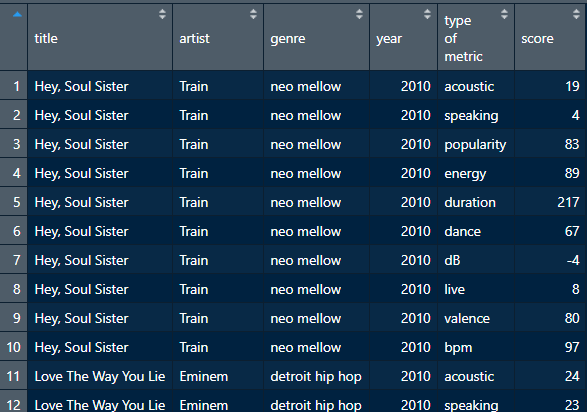

## A few extra fun things that I thought might take up too much time but are still useful to learn to do.

# Day One: Making a Shapiro Wilk Test for GRE scores in grad school applications

```{r}
library(readr) # call library you need
grad_school <- read_csv("grad_school.csv") # read in necessary file about graduate school
```


To plot a histogram of, for example, the GRE scores of the applicants, you could run the command below. We use the **$** operator to reference the columns of the dataset by name.

```{r}
hist(grad_school$gre) # makes a histogram of GRE scores
```

Looking at the dataset, we can see that the GRE scores do seem to show a normal distribution. In fact, the GRE is designed to have a normal distribution (some people do quite poorly, some people do quite well, and most people do right about the middle). How would we test whether this data set is normal?
  
  Answer: Use a Shapiro-Wilk test!
  
  ```{r}
shapiro.test(grad_school$gre)
```

Here's the results of the Shapiro-Wilk test. If you've taken a statistics class, you might remember that the threshold for significance is .05. This data seems to fail the Shapiro-Wilk test. It certainly does deviate from the normal distribution!
  
  Remember when we plot normal distributions that it has two parameters, mean and standard deviation.

```{r}
mean(grad_school$gre) # get mean of grad school gre scores
sd(grad_school$gre) # get standard deviation of grad school gre scores
hist(grad_school$gre, freq=F, xlim=c(280,360)) # relative frequency histogram with custom x axis limits
curve(dnorm(x, mean=316.8075, sd=11.47365), add=TRUE, col="darkblue", lwd=2) # curves a normal distribution atop a frequency histogram
```


# Day Two:

### Built-in Datasets

R has built-in datasets that many people use, especially when trying to provide a reproducible example (reprex) when asking for help or debugging. These datasets can be found using the _data()_ function. Popular ones are:

```{r}
head(mtcars) # motorcars
```

```{r}
head(diamonds) # diamond dataset. Are diamonds a girls' best friend? This girl doesn't love diamonds, especially blood ones.
```

## Pivot Longer

Pivoting in dplyr can be very helpful if you want your data to be a different shape. Let's say, for example, that we wanted the Spotify data to look different. Here's what it looks like now:

```{r}
spotify <- read_csv("spotify.csv") #reads in spotify data
short_spotify <- head(spotify) # makes a shorter version of spotify
```

What if we wanted to have the data be longer than it is? i.e., we had just ONE column of numbers, and another column showed which value it was?

```{r, out.width="100%"}

```

Enter _pivot_longer()_ from dplyr. We use the pipe! In pivot longer, the first argument is the names of all the columns that we want to be pivoting. The next thing is it creates key-value pairs, which you need to rename (or else it'll just call them "key" and "value").

```{r}
long_spotify <- short_spotify %>%
  pivot_longer(cols=c("acoustic","speaking","popularity","energy","duration","dance","dB","live","valence","bpm"),names_to="type of metric", values_to="score")
```

## Pivot Wider


# Day Three: MORE HERE

